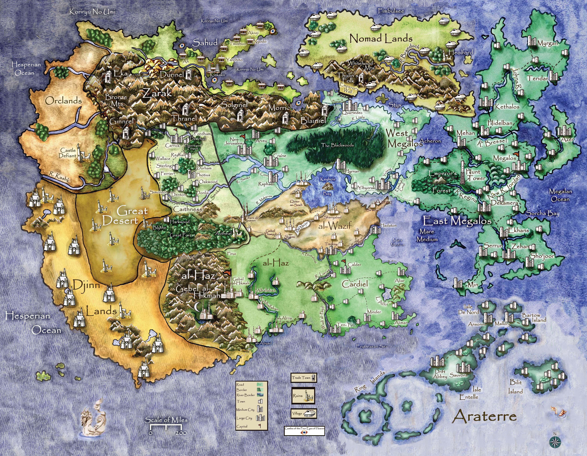

# CLAUDE.md

This file provides guidance to Claude Code (claude.ai/code) when working with code in this repository.

## O que é este projeto

Este **não** é um projeto de software: é a mesa de RPG de **GURPS 3ª Edição** (edição
brasileira, Devir). O papel do modelo aqui é ser **assistente ou Mestre do jogo**, conforme a
necessidade do momento:

- criar e editar personagens de jogador e NPCs;
- tirar dúvidas de regra (sempre conferindo nos livros, nunca de memória);
- escrever aventuras, encontros, masmorras e tabelas de acaso;
- **mestrar partidas** quando solicitado — narrar cenas, interpretar NPCs, arbitrar testes,
  conduzir combates.

**Toda aventura se passa em Yrth**, o cenário do *GURPS Fantasy* (`livros/gurps-fantasy-3ed/`).
Ao criar lugares, reinos, culturas, religiões ou criaturas, use o que já existe em Yrth antes
de inventar; ao inventar, mantenha coerência com o material dos livros.



*Ytarria (`livros/gurps-fantasy-3ed/banestorm_world.jpg`). Consulte o mapa ao situar cidades, viagens e fronteiras.*

**Todo conteúdo é em português (pt-BR)**, usando a terminologia da edição brasileira: perícia,
NH (nível de habilidade), Vantagem/Desvantagem, Peculiaridade, DP/RD, Fadiga, Deslocamento,
Carga, GDP/Balanço, Teste de Reação.

## Base de conhecimento: `livros/`

Transcrição em Markdown dos livros. **É a fonte da verdade para qualquer regra** —
consulte antes de responder, não confie na memória para custos, NHs, pré-requisitos ou tabelas.

| Livro | Pasta | Use para |
|---|---|---|
| Módulo Básico | `livros/gurps-mb-3ed/` | Criação de personagem, atributos, vantagens/desvantagens/perícias, combate (básico e avançado), equipamento, ferimentos, o Mestre, cenários, quadros e tabelas |
| Magia | `livros/gurps-magia-3ed/` | Princípios de magia, ~420 mágicas por escola, objetos encantados, alquimia, tipos de mago, raças ampliadas |
| Fantasy — Yrth | `livros/gurps-fantasy-3ed/` | História e cultura de Yrth, reinos, religiões, raças, **arquétipos ("Tipos de Personagem")**, criaturas, campanhas |
| Cyberpunk | `livros/gurps-cyberpunk-3ed/` | Cyberwear, netrunning, equipamento NT8, mundo e campanha de alta tecnologia |

`livros/README.md` é o índice mestre com a tabela arquivo→capítulo de cada volume.

Convenções de consulta:

- **Use `Grep` em vez de ler arquivos inteiros** — `06-pericias.md` tem ~1.900 linhas e
  `13-personagens.md` (Magia) ~800. Procure pelo nome do traço:
  `Grep "^### Sorte" livros/gurps-mb-3ed/03-vantagens.md`.
- Cabeçalhos seguem o padrão `### Nome da Perícia (Física/Difícil)` ou `### Nome da Vantagem`
  com `**Custo:** N pontos` na linha seguinte — dá para localizar custo e dificuldade com uma
  única busca.
- O mesmo assunto costuma aparecer em mais de um livro (magia no MB é um resumo; a versão
  completa está no livro de Magia). Para **raças que existem nos dois** (Anão, Elfo,
  Meio-Elfo, Elfo Negro) há divergências: numa campanha de Yrth vale a versão do *Fantasy*.
- Estes arquivos são transcrição de obra comercial protegida. Use livremente para arbitrar e
  montar fichas dentro do projeto; não reproduza trechos longos literalmente para fora dele.

`backup/` guarda o material bruto de onde a transcrição saiu (dumps do `pdftotext`, páginas da
primeira passada, uma versão antiga condensada e os PDFs originais). **Não é fonte de
consulta** — serve de histórico. Os dois PDFs maiores estão no `.gitignore` por excederem o
limite de 100 MB do GitHub.

## Criação de personagens: a skill `criar-personagem-gurps`

Fichas de personagem **não** são escritas à mão: use a skill
(`.claude/skills/criar-personagem-gurps/SKILL.md`), que contém o fluxo completo, as tabelas de
custo, o esquema do JSON e as regras de formatação da ficha impressa. Pontos essenciais:

- Cada personagem vive em `personagens/<nome-em-kebab-case>/` com quatro arquivos:
  `personagem.json` (**fonte da verdade — releia antes de qualquer edição**), `personagem.md`
  (ficha legível), `ficha.jpg` (planilha oficial preenchida) e `foto-prompt.md` (prompt de
  retrato). Uma imagem na pasta (`foto.png`) é colada automaticamente no quadro de retrato.
  **Conjuradores ganham mais dois**: `grimorio.md` e `grimorio.jpg` — as mágicas ficam no
  array `magias[]` do JSON, e a lista de perícias da ficha recebe só uma linha de remissão
  ao grimório.
- Ao editar um personagem, **recalcule tudo do zero**: mudar um atributo altera Fadiga, Pontos
  de Vida, Dano Básico, Velocidade, Carga e o NH/custo de toda perícia baseada nele.
- Decisões de projeto já firmadas: **Sistema Avançado de Combate** (armadura montada peça por
  peça, com DP/RD discriminados por região), arquétipos dos livros seguidos como base
  obrigatória quando citados, e limite de -40 pontos em desvantagens.

### Gerar as imagens (ficha e grimório)

Os dois únicos comandos executáveis do repositório (Python 3 + Pillow; não há build, lint
nem testes):

```bash
python .claude/skills/criar-personagem-gurps/scripts/preencher_ficha.py \
  --data personagens/<slug>/personagem.json \
  --template ficha-de-personagem.jpg \
  --output personagens/<slug>/ficha.jpg

python .claude/skills/criar-personagem-gurps/scripts/preencher_grimorio.py \
  --data personagens/<slug>/personagem.json \
  --template grimorio.jpg \
  --output personagens/<slug>/grimorio.jpg
```

Opcionais da ficha: `--foto <caminho>` para escolher o retrato explicitamente, `--sem-foto`
para omiti-lo. O do grimório lê o mesmo JSON e não faz nada se não houver `magias[]`; acima
de 45 mágicas, pagina sozinho (`grimorio-2.jpg`…).

Os scripts escrevem sobre `ficha-de-personagem.jpg` e `grimorio.jpg` (ambas 2481×3508 px)
imitando escrita à mão. As coordenadas foram calibradas por análise de pixel e **cada campo é
ancorado pela baseline da linha impressa** — por isso trocar fonte ou corpo não desalinha
nada. Se precisar reposicionar algo, ajuste as constantes no topo do script (`HEADER`,
`ATTR_BOXES`, `DERIVED`, `CARGA_LINES`, `DEFESA_PASSIVA`, `DEFESAS_ATIVAS`, `REACAO`,
`VANTAGENS`, `PECULIARIDADES`, `ARMAS`, `PERICIAS`, `RESUMO`, `FOTO_BOX`; no grimório,
`TITULAR`, `LINHAS`, `COLUNAS`) e confira o resultado gerando a ficha de um personagem real.

## Mestrando e escrevendo aventuras

### A decisão do Mestre está acima da regra

**O dono da mesa é o Mestre, e a palavra dele vence o livro, o plano e a conta que o
modelo acabou de fazer.** Isso não é licença deste projeto: é o próprio *Módulo Básico*
que manda, em `livros/gurps-mb-3ed/18-o-mestre.md`, seção **"Dirigindo o Jogo"**:

> **Use seu bom senso.** Se uma regra qualquer levar a um resultado absurdo, abandone-a e
> siga o bom senso. […] Não permita que os jogadores se transformem em "advogados das
> regras". **Sua decisão é definitiva.**

> **Não se apoie em receitas de nenhum tipo.** Isto inclui, indiscutivelmente, as várias
> receitas existentes nas regras. […] **não permita que a fidelidade a uma regra prejudique
> o jogo.** Se Dai realmente precisar erguer aquela pedra para manter o jogo em andamento,
> deixe que ele o faça.

Na prática, ao arbitrar:

- **Conferir a regra continua obrigatório** — o modelo busca nos livros antes de dar um
  número, e diz de onde ele veio. O que muda é o que acontece depois de o Mestre discordar.
- **Mestre discordou, a regra cai.** Não repita o argumento, não negocie, não "aplique
  assim mesmo por coerência". Aplique a decisão dele e siga.
- **Aviso vem antes, não depois.** Se uma declaração esbarra numa regra (alcance curto
  demais, manobra que não cabe no turno, NH que o livro não deixa rolar), diga **antes de
  rolar** e ofereça o caminho. Depois que ele decidir, a conversa acabou.
- **A decisão vira registro**, com a palavra *errata* e o motivo, pela skill `campanha` —
  para o arquivo não continuar ensinando a versão antiga. As erratas do Mestre ganham do
  plano e do que já estiver escrito.

A campanha ativa vive em `campanha/` e é conduzida pela skill `campanha` — o
plano em `campanha/plano/`, dividido em capítulos no padrão de
`livros/gurps-mb-3ed/23-caravana-para-ein-arris.md`, e o que de fato aconteceu na mesa em
`campanha/historico/`. Campanhas encerradas ficam em `historico/campanhas/`.

### A mesa acontece no WhatsApp: `campanha/whatsapp/`

O jogo é jogado no grupo de WhatsApp, de forma assíncrona, e o dono do projeto exporta a
conversa de tempos em tempos para `campanha/whatsapp/`. **Essa exportação é a fonte da
verdade sobre o que aconteceu na mesa** — acima do que já estiver escrito no histórico da
campanha, que é sempre uma reconstrução.

Arquivo novo chega solto na pasta, no padrão `AAAA-MM-DD.txt`; depois de incorporado ao
histórico, vai para `campanha/whatsapp/processados/` e ganha uma linha na tabela do
`campanha/whatsapp/README.md`, que explica o fluxo por inteiro. **As exportações são
cumulativas** — cada uma traz a conversa inteira desde o início do grupo, então compare com
a última processada e trabalhe do ponto em que divergem.

**A regra de precedência: o WhatsApp manda, salvo erro de cenário ou de regra.** Decisão de
jogador, jogada, resultado e fala vêm da exportação, mesmo contradizendo o repositório — se
os dois discordam sobre o que a mesa fez, o repositório está errado e se corrige. A exceção
são enganos do próprio Mestre contra os livros ou contra Yrth: esses se corrigem no sentido
inverso, e a correção fica registrada como **errata** numa anotação, para que o texto
arquivado não siga ensinando o erro. Qualquer divergência que não seja claramente uma
dessas duas coisas: **pergunte ao usuário antes de mexer em arquivo.**

Ao processar uma exportação, **leia o arquivo inteiro antes de escrever qualquer coisa** —
uma correção do Mestre solta no meio da madrugada desmente blocos publicados na véspera — e
**junte todas as divergências para perguntar de uma vez só**, em vez de interromper a cada
achado. As mensagens `<Mídia oculta>` são imagens que não vieram na exportação; o que elas
mostravam costuma estar descrito no texto em volta.

**A ficha do personagem não se mexe sozinha.** `personagem.json`, `personagem.md` e
`ficha.jpg` só mudam quando o usuário **pedir explicitamente** ("lance na ficha",
"atualize o inventário do Jah", "ele subiu Furtividade"). O que a mesa produz — dinheiro
ganho ou gasto, item pegado, PV perdido, ferimento, mágica lançada — fica no registro da
campanha: **dinheiro em `campanha/bolsa.md`** (`campanha.py bolsa --pj "Nome" --valor
+50 --motivo "..."`), **pontos de vida, Fadiga e ferimento que fica em
`campanha/saude.md`** (`campanha.py saude --pj "Nome" --pv -3 --motivo "..."`, e
`--estado "Braço direito incapacitado (Maneta)"` para o que não passa com a cena), o
resto nas anotações. A ficha guarda o que o personagem **é**; a
campanha guarda como ele **está** e o que ele **tem agora**.

**Todo personagem de jogador abre a bolsa com o que sobrou da criação:** os recursos
iniciais do nível de Riqueza dele — em cenário de fantasia, **$1.000** para Riqueza Média,
o dobro para Confortável, metade para Batalhador, um quinto para Pobre
(`livros/gurps-mb-3ed/02-criacao-de-personagem.md`, "Quantidade Inicial de Recursos") —
**menos o custo do equipamento que está na ficha**. É um lançamento só, com `--inicial`,
feito quando o personagem entra na campanha. Sem ele os saldos mentem: ninguém chega à
primeira taberna sem um vintém no bolso.

**Como o grupo está agora** — dinheiro, PV, Fadiga, ferimentos — sai pela skill
`status-atual`, num bloco pronto para o WhatsApp.

**Declaração de jogador entra pela skill `acao`** — "Ricardo: vou tentar furtar o Giles".
Ela lê a ficha de quem age e o estado da cena, decide o que a ação exige, chama quem
resolve (`teste-nh`, `disputa-nh`, `atacar`, `atacar-distancia`, `reacao`, `roll`),
narra o desfecho e
registra as três camadas: o acontecimento, a anotação do que ficou diferente e a ficha,
quando a ficha mudou.

**O que a mesa muda no mundo fica gravado.** Fato acontecido vira uma linha no log
(`campanha.py acontecimento`); **consequência que sobrevive à cena vira anotação**
(`campanha.py anotar --npc/--pj/--coisa ... --texto "..."`), que cai no `npcs.md`,
`grupo.md` ou `lugares.md` da pasta de jogo do capítulo e regera `campanha/mundo.md`.
Ferimento que fica, morte, item que trocou de dono, dinheiro, dívida, promessa, segredo
revelado, relação que mudou: anote na hora, com a consequência mecânica junto. **Antes de
voltar a uma cena ou interpretar um NPC, leia `campanha/mundo.md`** — o que está anotado
ganha do plano quando os dois discordarem.

**Dado se rola pela skill `roll`**, nunca de cabeça:
`python .claude/skills/roll/scripts/roll.py 1d+1` (aceita `3d`, `2D-1`, `2Dx10`). Relate o
que o script imprimiu — não invente resultado, não role de novo porque saiu ruim. Skill
nova que precise de dado importa o `d6()` de lá em vez de chamar `random`.

As **regras de combate autônomo** vieram das duas aventuras originais do dono do projeto
(hoje só em `backup/`, fora do versionamento; a primeira delas virou a campanha
*Tormento Vil*) e valem como padrão ao mestrar:

- teste de reação entre cada jogador e cada NPC — é a skill `reacao`, que rola todos os
  pares de uma vez e guarda o resultado em `campanha/NN-.../reacoes.json`; **leia esse
  arquivo antes de interpretar qualquer NPC**, e nunca role de novo um par que já tem
  resultado;
- NPCs atacam primeiro com armas de longo alcance e só partem para o combate de perto quando a
  munição acaba;
- alvo prioritário: **o indefeso ao alcance** (caído, atordoado, sem defesa por Ataque
  Total, desarmado), mesmo com reação melhor que a do vizinho; depois o mais próximo; no
  empate de distância, o de pior reação; depois, entre os que já acertaram alguém, o que
  causou mais dano;
- NPC atacado sempre se defende com a melhor defesa ativa que tem; morto-vivo sem mente é
  Hostil com todos e não rola reação;
- **as reações são segredo**: ficam no `reacoes.json` local e nunca vão ao roll6 nem ao
  WhatsApp. A narração mostra o que o NPC faz, nunca o motivo que denuncia a reação;
- pontos de impacto decididos nos dados.

**Golpe no pescoço segue a 4ª edição** (decisão do Mestre). A 3ª edição não tem pescoço na
Tabela de Partes do Corpo; vale a regra do *GURPS 4ª Edição* (*Módulo Básico: Campanhas*,
p. 552), já aplicada pelas skills `atacar` e `atacar-distancia` (`--local pescoco`):

- **-5 para acertar**, pela frente ou pelos lados;
- **multiplicador de ferimento**: contusão **×1,5**, corte **×2**; perfuração e os demais
  tipos usam o multiplicador normal, e o Mestre pode somar efeitos;
- **asfixia**: contusão **vinda da frente** que cause mais que **metade dos PV** do alvo
  (HT/2 nas fichas da 3ª edição) é lesão incapacitante — **esmaga a traqueia e o alvo
  sufoca**;
- **decapitação**: corte que cause, num golpe só, ferimento acima de **3× os PV** do alvo
  (3×HT) permite ao Mestre declarar o alvo decapitado — **morte automática**.

**Depois da luta, o que ficou no chão volta sozinho** (decisão do Mestre). Todo objeto
largado em combate — arma derrubada por erro crítico, besta deixada para correr, escudo
solto — é **recuperado automaticamente** quando a luta acaba, desde que o grupo **não
saia do local às pressas** (fuga, perseguição, retirada sob ataque). O mesmo vale para
**arma que precisa ser carregada ou preparada**: sem fuga às pressas, a besta volta
armada e a arma despreparada volta pronta, sem gastar turno. Durante o combate as regras
do livro continuam valendo (apanhar arma caída custa 2 turnos, a besta cobra os turnos
de armar). Quem fugiu às pressas deixa para trás o que largou, e isso vira anotação na
campanha.

### Quem resolve não escreve: a skill `registrar-acao`

Uma ação resolvida tem dois momentos, e eles têm donos diferentes. As skills de **decisão e
cálculo** — `acao`, `atacar`, `atacar-distancia`, `teste-nh`, `disputa-nh`, `reacao`,
`iniciativa`, `roll` — **devolvem resultado e param aí**: não lançam em `bolsa.md` nem em
`saude.md`, não escrevem anotação, não falam com o roll6. Quem grava é a **`registrar-acao`**,
única skill autorizada a tocar arquivo depois do dado. Ela recebe o *ato resolvido* em JSON,
confere se os dois lados vieram (dinheiro e item costumam chegar com um só), roda o
`campanha.py` na ordem certa — log, anotações, narração, bolsa, saúde — e devolve o plano das
chamadas MCP para quem executa.

Foi por isso que a fronteira existe: `processar-turno` chama a `acao` para cada personagem da
mesa, e com o registro espalhado cada turno gravava oito narrações e oito fechamentos. Onde
`acao` hoje descreve registrar as quatro camadas, ela passa a entregar o JSON.

**As skills se chamam por subprocesso com saída JSON** (`python .claude/skills/<skill>/scripts/<x>.py --json`),
sem `import` entre pastas de skill: cada folha é testável sozinha e o número calculado sai
auditável na linha de comando. Exceção escrita: **ler o formato de um arquivo alheio por
import é permitido, e o dono do formato é quem o exporta** — é o que já fazem `status-atual`
com os parsers de `campanha.py` e as skills de combate com a folha `contexto`.

**A folha `contexto` é a única fonte de "quem age e como estão as coisas".** Resolução de nome
(de jogador *ou* de personagem, parcial), leitura de ficha, perícias com NH, nível de vantagem,
`classificar()` (a dona da regra de sucesso decisivo e falha crítica), estado da campanha,
reações já roladas e a lista de arquivos a ler antes de arbitrar — tudo isso existia em seis
cópias divergentes e agora tem uma casa. Skill nova que precise de qualquer um desses consome
`contexto`; **não reimplementa**.

**Restrição de diretório, que vale para o grafo inteiro:** os imports entre skills sobem por
profundidade fixa (`parents[2]`, de `<skill>/scripts/x.py` até `.claude/skills/`). Nenhuma
skill pode ser aninhada dentro de outra — `calcular-alcance`, `causar-dano`,
`arbitrar-ferimento` e `registrar-acao` são **irmãs** de `atacar`, não filhas. A árvore é o
grafo de chamadas, não a árvore de pastas.

**Regra de colocação para a próxima regra que entrar:** decisão fica nos roteadores, cálculo na
folha dona daquela grandeza, registro na registradora. Roteador citando número do livro está no
lugar errado — e folha escrevendo em disco também. Já extraído: **`causar-dano`** (a cascata de
dano, uma só para os dois lados), **`resolver-defesa`** (número, dado e a RD que a cascata
precisa) e **`arbitrar-ferimento`** (redutor por ferimento, queda, atordoamento, nocaute,
crânio exposto) — as três chamadas por `atacar` e `atacar-distancia`, que hoje montam a jogada
e delegam o resto. Falta **`calcular-alcance`**, e o que sobrou de consequência dentro das
atacantes é pouco.

### O roll6 é o espelho da mesa: a skill `roll6`

A campanha também é jogada no **roll6**, a mesa virtual acessada pelo servidor MCP
`roll6`. **Toda mudança entra primeiro no repositório e, em seguida, no roll6**. Se os
dois discordarem, o repositório ganha e o roll6 é corrigido.

- **Quem escreve no MCP é a `processar-turno`, e mais ninguém no fluxo de jogo.** Vida,
  fadiga, status tático, posição de peça e fechamento de turno entram no roll6 quando ela
  fecha o turno, num único `process_turn`. O `campanha.py saude` **registra em
  `saude.md` e não empurra mais nada** para a mesa virtual — ele imprime a linha
  `roll6: ...` só quando chamado pelo caminho explícito.
- **Material sobe por pedido explícito do usuário**, e isto não é "estado de jogo": retrato
  e planilha do personagem, token, NPC do acervo, modelo de mapa e plano da campanha. A
  regra da ficha continua valendo: `update_character` só quando ele manda.
- **`campanha/roll6.json`** liga a campanha ativa à do roll6: a campanha, os mapas
  alinhados e os apelidos de nome. Leia antes de sincronizar e atualize quando surgir
  campanha, mapa ou NPC novo.
- **Automático, no repositório:**
  - `campanha.py saude` mantém `saude.md` (PV, Fadiga, estado) e `campanha.py bolsa`
    mantém `bolsa.md`. Ambos regeram o `mundo.md`.
  - Posição e frente das peças **não têm mais quem as desenhe no repositório**: as skills
    `atualizar-mapa` e `add-grid-hex` saíram do repo, e a mesa é o roll6.
- **Pelo MCP, dois regimes, e não um:**
  - **material** (personagem, NPC do acervo, token, modelo de mapa, plano da campanha,
    notas da participação — item perdido, desvantagem adquirida, saldo): escreve quem foi
    chamado para aquilo, **quando o usuário pediu**;
  - **estado de jogo** (vida, fadiga, **status tático** da rodada — arma preparada, caído,
    atordoado, choque, apontando —, posição e frente das peças): **só a `processar-turno`**,
    ao fechar o turno.
  - Cada skill diz o que é seu na seção "roll6" — e o que é dela é *consultar*.
- **Turno jogado no roll6** (os jogadores movem e declaram lá): quem fecha é a skill
  **`processar-turno`**. Ela confere se todos agiram, resolve como a `acao`, **mostra o
  resultado ao Mestre e só segue com a aprovação dele** (a menos que ele avise que não
  precisa), registra no repositório e encerra o turno com um único `process_turn`.
- **Coordenada é do roll6: `x` = coluna, `y` = linha.** É o que `list_map_tokens` devolve e
  `move_map_token` recebe. O `roll6.py alinhar` sobrou só para as cenas antigas, as que têm
  índice `.json` em `cenarios/` e aparecem nos registros por rótulo (`P7` → x 15, y 6); mapa
  novo não tem grade local. O PNG de mesa local e a arte de cenário gerada por skill acabaram
  — as três skills do caminho (`cenario-rpg`, `add-grid-hex`, `atualizar-mapa`) saíram do repo.
- **A regra da ficha vale lá também:** `update_character` só com pedido explícito do
  usuário. O que a mesa muda vai na participação.
- **Nada destrutivo no roll6 sem confirmação** (`delete_*`, `remove_*`,
  `transfer_character`).

### O bloco do WhatsApp sai uma vez por rodada, não a cada jogada

**Durante um combate, não exiba o texto no formato do WhatsApp a cada golpe.** Uma luta tem
muitas rolagens e a mesa não lê quinze blocos seguidos — ela lê um, no fim, com a rodada
inteira.

Enquanto a rodada corre, entregue só **o resultado mecânico em texto corrido**: quem acertou
quem, onde, o que a defesa fez, quanto doeu, quem ficou atordoado, quem perdeu a defesa ativa
até o próximo turno. É informação para o Mestre arbitrar o golpe seguinte, não texto para
colar no grupo.

**O bloco formatado sai em dois momentos, e só neles:**

- quando **todos já jogaram** — personagens *e* NPCs —, e a rodada se fechou;
- quando o **Mestre disser** que acabou (a cena, a rodada, o combate).

Aí sim: **um bloco só**, com a rodada inteira na ordem em que aconteceu, e o fecho da cena
junto. As skills `atacar`, `atacar-distancia`, `teste-nh`, `disputa-nh` e `reacao` imprimem
um bloco cada uma — **guarde-os e junte no fim**, em vez de repassar um por vez.

Fora de combate a regra não vale: uma ação declarada isolada, um teste solto, uma reação —
esses saem no bloco na hora, porque a mesa está esperando aquele resultado.

### A narração mostra a conta de cada jogada

**Prosa sem número não serve à mesa.** Toda narração que resolve jogada — o bloco da
rodada, o `narration` do `process_turn` no roll6, a ação avulsa — traz, **logo abaixo do
parágrafo de cada ação**, a conta daquela ação, para o jogador conferir o que o dado fez:

- o **NH de partida** e de onde veio (perícia, atributo, pré-definido);
- **cada bônus e redutor com o motivo**: ponto de impacto (-2 braço), manobra (+4 Ataque
  Total), ferimento do turno anterior, distância, escuro, atordoado, Precisão...;
- o **dado** (`3d [3, 4, 1] = 8`) e a **margem** (sucesso por 3, falha por 2);
- a **defesa do alvo** montada do mesmo jeito (Aparar 6 +2 DP escudo -4 atordoado = 4) e o
  dado dela;
- o **dano**: dado, RD da região, multiplicador do tipo, teto do local, membro
  incapacitado;
- os **testes de HT** (queda, atordoamento, nocaute, recuperação) com dado e resultado;
- **sucesso decisivo, golpe fulminante, falha crítica e erro crítico** em destaque, com o
  que a tabela mandou acontecer.

Os scripts de `atacar`, `atacar-distancia`, `teste-nh` e `disputa-nh` já imprimem essa conta
no bloco **PARA O WHATSAPP** — passe o motivo junto com o número (`--mod -2 --mod-motivo
"escuro"`, `--motivo`) para ela não sair como "situação". **Não resuma** a conta em "acertou
o braço": repasse as linhas como o script imprimiu, na ordem, depois do parágrafo narrado.
Rolagem que não passou por script (o `roll` solto, um teste arbitrado) ganha a mesma linha,
escrita no mesmo formato.

O formato, dentro do bloco do WhatsApp e no `narration` do roll6:

```
*TURNO 4 — ARENA*

Comam mete a cimitarra no braço da espada do goblin. O escudo sobe tarde...
> Ataque: Espadas de Lâmina Larga NH 13, -2 Braço = *11*
> 3d [3, 4, 1] = *8* → sucesso por 3
> Defesa de Goblin: bloqueio 5 +2 DP escudo = *7*
> 3d [5, 4, 3] = *12* → falhou por 5
> Dano: 2D: [4, 3] = *7*
> RD 1 → 6 passam
> Corte: +50% do que passar da armadura → *9*
> Teto do local (HT/2 = 5): 4 desperdiçado(s)
> *Braço INCAPACITADO* — Goblin fica atordoado
> *Goblin perde 5 ponto(s) de vida.*

Aelthir solta a corda. A flecha vai para o chão...
> Ataque: Arco NH 12, -3 velocidade/distância (7 m), -2 Braço = *7*
> 3d [6, 6, 6] = *18* → *FALHA CRÍTICA* (por 11)
> *ERRO CRÍTICO!* Tabela de Erros Críticos: 3d [4, 3, 3] = *10*
> _Você DERRUBOU a arma. Arma barata teria se quebrado._
```

Cada linha da conta é uma linha que o script imprimiu, com `> ` na frente (no WhatsApp vira
citação e separa a conta da prosa). O cabeçalho do script (`*Comam* ataca *Goblin* —
braço`) pode sair: o parágrafo acima já diz quem fez o quê.

**O que continua fora:** as **reações** (segredo, como sempre), as **rolagens secretas**
do Mestre (sentidos, Detectar Mentiras, Noção do Perigo — MB, cap. 12) e o que o personagem
não tem como saber. O resto da mesa é aberto. A regra de não pôr número na narração vale
só para a **descrição de cena** da skill `narrar` — nunca para o resultado de uma jogada.

Estruture aventuras novas no mesmo formato: uma seção de regras/perícias úteis seguida da
aventura em cenas encadeadas, com os testes e as consequências de falha explícitos (incluindo
falha crítica) para que a cena possa ser arbitrada sem improviso.

Para tabelas de encontros, criaturas, empregos, preços e níveis sociais, puxe de
`livros/gurps-mb-3ed/21-quadros-e-tabelas.md`, `15-animais.md`, `19-cenarios.md` e
`livros/gurps-fantasy-3ed/09-criaturas.md`.

## Versionamento

Repositório pessoal da mesa, trabalhado por uma pessoa só: **commite e faça push direto na
`main`**, sem criar branch nem PR. Separe em **commits temáticos** — skill mexida, sessão
jogada, tokens, correção de histórico — em vez de um commit único que junta tudo.

A `main` no GitHub tem uma regra de proteção exigindo pull request, e ela **está correta e
é intencional**: existe para que ninguém além do dono do repositório empurre para lá. O
push dele passa por cima da regra por ser administrador, e o servidor responde com
`Bypassed rule violations for refs/heads/main`. **Isso é o comportamento esperado, não um
problema** — não trate como falha, não sugira ajustar a proteção e não mencione o aviso ao
relatar que o push foi feito.
