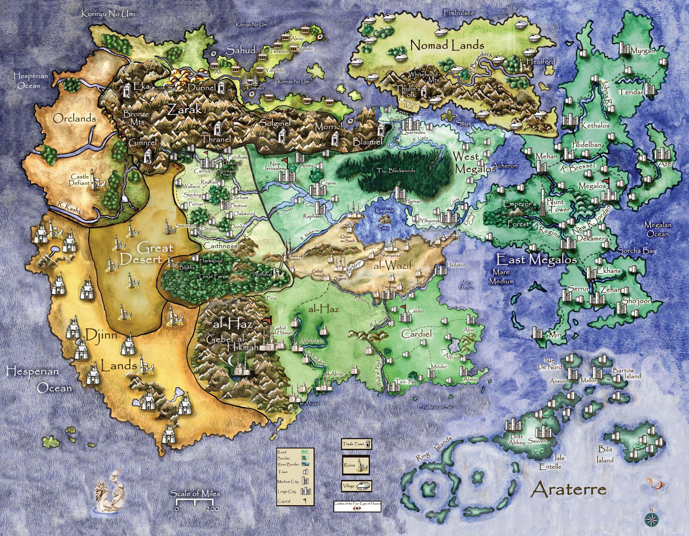

# Plano — Gélido Lamento

Adaptado da aventura original do dono do projeto (hoje fora do versionamento, em
`backup/Aventura de GURPS.md`) para o formato de *Caravana para Ein Arris*
(`livros/gurps-mb-3ed/23-caravana-para-ein-arris.md`): uma Descrição do Cenário que pode
ser lida aos jogadores, e depois capítulos numerados como cenas encadeadas, com os testes
e as consequências de falha explícitos.

*A campanha começa em Wallace (Caithness), atravessa o Grande Deserto e termina em Zarak.*

## Descrição do Cenário

*(Esta seção pode ser lida em voz alta aos jogadores antes da criação de personagens. **O
resto do plano é para os olhos do Mestre apenas.**)*

**Caithness** é o reino mais ocidental das terras humanas de Ytarria — uma fronteira
áspera, arrancada dos orcs há gerações e nunca completamente pacificada. O rei em Carrick
manda pouco além das muralhas da capital; na prática, cada barão governa o que consegue
defender. **Wallace** é uma dessas cidades de fronteira: muralha de pedra, um castelo
acima dela, e o Lorde William de Wallace no comando.

O **nível tecnológico é 3**. Espada, malha, besta, cavalo. Não há pólvora.

**Magia existe e é conhecida**, ainda que rara e malvista pela Igreja. O que qualquer
morador de Caithness sabe é isto: a magia depende do **mana**, e nem toda terra tem mana.
O **Grande Deserto**, a leste, é uma **zona de mana nulo** — lá nenhuma mágica funciona e
nenhum objeto encantado tem poder. Caravanas atravessam-no; magos evitam-no.

Do outro lado do deserto ficam as montanhas de **Zarak**, a terra dos anões, e mais além
as terras órquicas. Anões comerciam com humanos e desprezam-nos moderadamente. Orcs em
Caithness são inimigos históricos.

**A religião** é cristã, e a Igreja de Caithness tolera a magia mais do que a de Mégalos,
mas não gosta dela. Mortos que se levantam são, para qualquer camponês, assunto de
demônio.

Os personagens estão em Wallace por seus próprios motivos — contrato, passagem, hospedagem
— na noite em que a cidade cai.

## Regras da casa

Estas valem em toda a campanha e vieram da aventura original:

**Combate autônomo.** Quando os NPCs agem sem o Mestre decidir caso a caso:

1. Teste de reação entre cada jogador e cada NPC.
2. NPCs atacam primeiro com armas de longo alcance, se tiverem; só partem para o combate
   de perto quando a munição acaba.
3. Alvo: o personagem **mais próximo**; depois o de **pior reação**; depois, entre os que
   já os atingiram, o que causou **mais dano**.
4. Pontos de impacto decididos nos dados.

**Perícias úteis nesta campanha:** perícias de combate, **Escalada**, **Trato Social**,
**Cavalgar**, **Navegação (Terra)**, **Sobrevivência (Deserto)**, **Furtividade**.

**Sistema Avançado de Combate** (MB, cap. 14) em todo combate com mapa: 1 hexágono = 1
metro, armadura peça por peça. Os mapas ficam em `cenarios/`.

## Estrutura

| Capítulos | Bloco |
|---|---|
| 1 a 4 | **A queda de Wallace** — da taberna à muralha |
| 5 e 6 | **A fuga** — William, a passagem secreta, a corrida até o deserto |
| 7 e 8 | **A travessia** — 200 km de deserto e a emboscada de Arzog |
| 9 e 10 | **A virada** — a traição e o que Eriel revela |
| 11 a 13 | **Os três itens** — a joia, o artesão anão e o baú |
| 14 | **O cerco de Wallace** — o desfecho |

`99-npcs.md` reúne as fichas de todos os NPCs e criaturas, para não repeti-las capítulo a
capítulo.

## A virada que sustenta a campanha

O Mestre precisa saber disto desde o começo, porque tudo é montado para chegar lá:

**A espada é a vilã.** *Gélido Lamento* foi criada por um elfo negro que aprisionou o
próprio espírito nela. Quem a empunha passa a amar mais a morte do que a vida. Arzog era
um portador fraco — queria vingança contra um homem só. **William quer conquistar**, e
por isso será muito pior.

Portanto: **Arzog não é o vilão, é o aviso.** Os personagens passam metade da campanha
achando que fogem do monstro, e a outra metade descobrindo que o carregaram consigo.

O **teste de reação com William** no capítulo 5 é o dado mais importante da campanha:
define se os personagens confiam nele até a traição do capítulo 9 ou se desconfiam antes
da hora. Anote o resultado.
